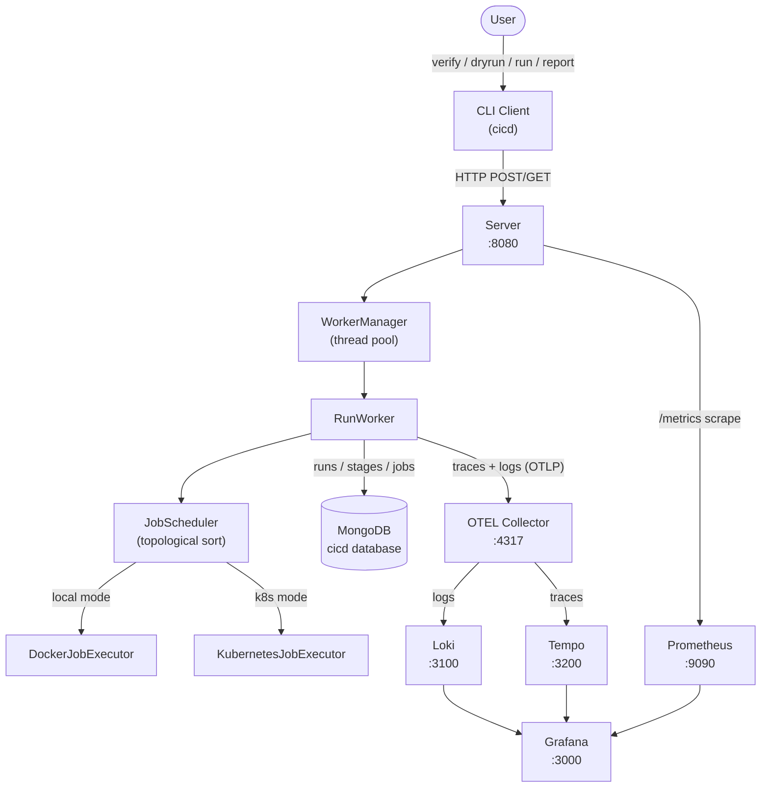
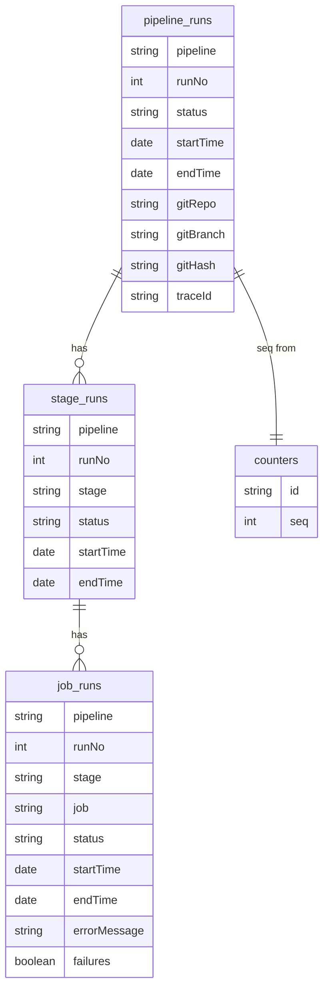
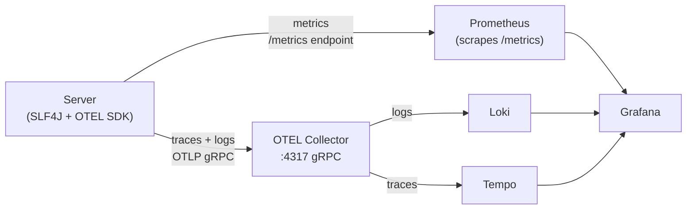
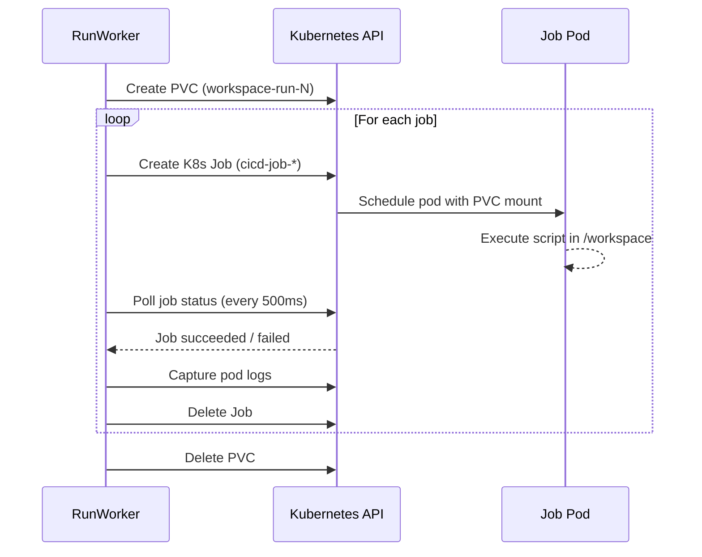

# CI/CD Pipeline System

A CI/CD pipeline system developed for the CS7580 DevOps course project.

It supports:
- pipeline validation
- dry-run planning
- pipeline execution
- execution reporting
- observability with Prometheus, Loki, Tempo, and Grafana
- deployment with raw Kubernetes manifests and Helm

---

## Submission Docs

- Feature status: [FeatureStatus.md](FeatureStatus.md)
- Control component API: [dev-docs/api/control-component-api.md](dev-docs/api/control-component-api.md)
- Datastore design: [dev-docs/design/datastore.md](dev-docs/design/datastore.md)

## High-Level Architecture



---

## User Guide

### What Users Need

There are two supported usage paths:

- **Local path**: run the platform on your machine with Docker Compose
- **Kubernetes path**: deploy the platform to a Kubernetes cluster with raw manifests or Helm

Users do **not** need to compile the server from source to use the system.

For normal usage:
- deploy the server platform with Docker, raw Kubernetes manifests, or Helm
- download the CLI client jar from GitHub Releases

### User Prerequisites

#### Local Path

Install:
- Java 21
- Docker Desktop or Docker Engine with Docker Compose
- Git

Example macOS install commands:

```bash
brew install openjdk@21 git
brew install --cask docker
```

Environment checks:

```bash
java -version
docker --version
docker compose version
git --version
```

#### Kubernetes Path

Install:
- Java 21
- Docker
- `kubectl`
- Helm
- a Kubernetes cluster such as minikube

Example macOS install commands:

```bash
brew install openjdk@21 kubectl helm minikube git
brew install --cask docker
```

Environment checks:

```bash
java -version
kubectl version --client
helm version
minikube version
docker --version
```

### Get the CLI Client

The CLI client is published on GitHub Releases:

- Release page: `https://github.com/CS7580-SEA-SP26/f-team/releases`
- Current release asset: `https://github.com/CS7580-SEA-SP26/f-team/releases/download/v0.1.5/client-all.jar`

Download the latest client jar directly with:

```bash
curl -L -o cicd.jar https://github.com/CS7580-SEA-SP26/f-team/releases/latest/download/client-all.jar
```

Or you can download the latest client jar directly from https://github.com/CS7580-SEA-SP26/f-team/releases/latest/download/client-all.jar and save it as `cicd.jar`

Create a convenient local command:

```bash
alias cicd='java -jar "$PWD/cicd.jar"'
```

### Local Deployment

Start the local platform:

```bash
docker compose up --build -d
```

Services:
- Server: `http://localhost:8080`
- Grafana: `http://localhost:3000`
- Grafana login: `admin / admin`

Validate the compose file itself:

```bash
docker compose config
```

### Kubernetes Deployment

#### Raw Kubernetes Manifests

Start your cluster first, for example:

```bash
minikube start
```

Then deploy:

```bash
kubectl apply -f k8s/
kubectl get deployments
kubectl get services
```

For the full raw Kubernetes walkthrough, see [k8s/README.md](k8s/README.md).

#### Helm

Validate the chart locally:

```bash
helm template cicd helm/cicd-chart
```

The chart is intended to deploy the same full system as the raw `k8s/` manifests.


Important: do not mix the raw k8s/ deployment and the Helm deployment in the same namespace.
If you previously deployed with:
```bash
kubectl apply -f k8s/
```
clean up those resources first before installing Helm:
```bash
kubectl delete -f k8s/ || true
helm uninstall cicd || true
```
If you want to use Helm as the primary Kubernetes deployment path, make sure:
- your cluster is running first
- the target namespace does not already contain an old `cicd` release

One local example is:

```bash
minikube start
helm uninstall cicd || true
helm install cicd helm/cicd-chart/
kubectl get deployments
kubectl get services
```

Expose the server and Grafana locally with:

```bash
kubectl port-forward svc/cicd-cicd-server-service 8080:8080
kubectl port-forward svc/cicd-grafana-service 3000:3000
```

Cleanup:

```bash
helm uninstall cicd
```

### Published Server Image

The published server image is available on Docker Hub:

- Repository page: `https://hub.docker.com/r/jasonte/cs7580fteam`

```text
jasonte/cs7580fteam:v0.1.4
```

You can pull either the current release tag or the rolling latest tag:

```bash
docker pull jasonte/cs7580fteam:v0.1.4
docker pull jasonte/cs7580fteam:latest
```

### CLI Usage

If your server is not at the default URL, set:

```bash
export CICD_SERVER_URL=http://localhost:8080
```

#### `verify`

Purpose:
- validate a pipeline YAML file

Command:

```bash
cicd verify .pipelines/success.yaml
```

Typical output:

```yaml
verify:
  valid: true
  messages:
```

#### `dryrun`

Purpose:
- preview execution order without running jobs

Command:

```bash
cicd dryrun .pipelines/success.yaml
```

Typical output:

```yaml
dryrun:
  valid: true
  plan:
    - stage: build
      job: compile
    - stage: test
      job: unit-test
    - stage: test
      job: integration-test
    - stage: deploy
      job: deploy-prod
```

#### `run`

Purpose:
- execute a pipeline against a Git repository

Command:

```bash
cicd run --name success --repo "$(pwd)" --branch "$(git branch --show-current)"
```

Notes:
- `--name success` resolves to `.pipelines/success.yaml`
- `--repo` must point to a real Git repository
- `--branch` should be explicit for local development; if omitted, the client defaults to `main`

Typical output:

```yaml
run:
  valid: true
  messages:
    - Run-No: 1
    - ✓ Pipeline Completed Successfully
```

#### `report`

Purpose:
- inspect stored execution history

Pipeline-level report:

```bash
cicd report --pipeline demo-pipeline
```

After running the sample pipeline once, reuse the `Run-No` printed by the `run`
command for narrower queries:

- run-level query: `report --pipeline demo-pipeline --run <run-no>`
- stage-level query: `report --pipeline demo-pipeline --run <run-no> --stage test`
- job-level query: `report --pipeline demo-pipeline --run <run-no> --stage test --job unit-test`

Typical output shape:

```yaml
pipeline: demo-pipeline
runs:
  - run-no: 1
    status: success
    stages:
      - stage: test
        jobs:
          - job: unit-test
            status: success
```

### Feature Usage

#### Allow Failure

Use `failures: true` on a non-blocking job:

```yaml
coverage-report:
  stage: test
  image: alpine:3.21
  needs:
    - unit-test
  script:
    - exit 1
  failures: true
```

Behavior:
- the job is recorded as failed
- the pipeline continues instead of stopping

Try it with:

```bash
cicd run --name allow-failure --repo "$(pwd)" --branch "$(git branch --show-current)"
```

#### Observability

Observability is available in both Docker Compose and Kubernetes deployments.

Main endpoints:
- Grafana: `http://localhost:3000`
- Prometheus: `http://localhost:9090`
- Loki: `http://localhost:3100`
- Tempo: `http://localhost:3200`

What to look for:
- metrics for pipeline, stage, and job counts/durations
- logs from server and job execution
- traces for pipeline runs

#### Kubernetes + Helm

Both deployment paths are supported:
- raw manifests with `kubectl apply -f k8s/`
- Helm with `helm install cicd helm/cicd-chart/`

Use raw manifests when you want explicit static resources.
Use Helm when you want a packaged deployment path.

### Cleanup

#### Local Docker Compose

```bash
docker compose down
```

#### Raw Kubernetes

```bash
kubectl delete -f k8s/
```

#### Helm

```bash
helm uninstall cicd
```

#### Local Port Forwarding

Stop any `kubectl port-forward` process with `Ctrl+C`, or kill the background process manually.

---

## Developer Guide

### Developer Prerequisites

Install:
- Java 21
- Git
- Docker with Docker Compose
- `kubectl`
- Helm
- minikube or another local Kubernetes cluster

Example macOS install commands:

```bash
brew install openjdk@21 git kubectl helm minikube
brew install --cask docker
```

### Build From Source

```bash
./gradlew :client:jar --no-daemon
./gradlew :server:jar --no-daemon
./gradlew clean build --no-daemon
./gradlew javadoc --no-daemon
```

### Run the Server Locally for Development

For local development, running the server on the host is the most reliable way to support:
- `run --repo "$(pwd)"`
- local Git branch execution
- CLI testing against your current checkout

Start a MongoDB instance first and make sure it is reachable at `mongodb://127.0.0.1:27017`.

Then start the server on the host:

```bash
OTEL_EXPORTER_OTLP_ENDPOINT=http://127.0.0.1:65535 \
MONGO_URI=mongodb://127.0.0.1:27017 \
MONGO_DB=cicd \
java -jar server/build/libs/server-all.jar
```

In another terminal, run the client:

```bash
java -jar client/build/libs/client-all.jar verify .pipelines/success.yaml
java -jar client/build/libs/client-all.jar dryrun .pipelines/success.yaml
java -jar client/build/libs/client-all.jar run --name success --repo "$(pwd)" --branch "$(git branch --show-current)"
java -jar client/build/libs/client-all.jar report --pipeline demo-pipeline
```

### Developer Validation Commands

These repository-level commands have been validated against the current repository state:

```bash
./gradlew :client:jar --no-daemon
./gradlew clean build --no-daemon
./gradlew javadoc --no-daemon
java -jar client/build/libs/client-all.jar --help
java -jar client/build/libs/client-all.jar verify .pipelines/success.yaml
java -jar client/build/libs/client-all.jar dryrun .pipelines/success.yaml
docker compose config
helm template cicd helm/cicd-chart
```

The `run` and `report` commands have also been validated when the server is started locally on the host with a reachable MongoDB instance.

### Developer Cleanup

Stop the locally started server with `Ctrl+C`.

If you started Docker Compose resources during development, stop them with:

```bash
docker compose down
```

If you started raw Kubernetes or Helm resources during development, use:

```bash
kubectl delete -f k8s/
helm uninstall cicd
```

## Validation Scripts

Repeatable validation helpers for high-risk submission flows are available in `scripts/`.

Recommended pre-submission checks:

```bash
chmod +x scripts/*.sh
./scripts/validate-local.sh
./scripts/validate-cli.sh
./scripts/validate-docker.sh
./scripts/validate-k8s.sh
./scripts/validate-helm.sh
```

---

## Example Pipelines

| File | Pipeline Name | Description |
|---|---|---|
| `.pipelines/success.yaml` | `demo-pipeline` | Clean 3-stage success |
| `.pipelines/allow-failure.yaml` | `sprint6-allowed-failure-demo` | Has an allowed-failure job |
| `.pipelines/block-failure.yaml` | `sprint6-blocking-failure-demo` | Has a blocking failure job |
| `.pipelines/test-parallel.yaml` | `test-parallel` | Parallel job execution |
| `.pipelines/normal.yaml` | `default` | Minimal single-job pipeline |

## Architecture

### MongoDB Schema



### Observability Data Flow



### Metrics

| Metric | Type | Labels |
|---|---|---|
| `cicd_pipeline_runs_total` | Counter | pipeline, status |
| `cicd_pipeline_duration_seconds` | Histogram | pipeline |
| `cicd_stage_duration_seconds` | Histogram | pipeline, stage |
| `cicd_job_duration_seconds` | Histogram | pipeline, stage, job |
| `cicd_job_runs_total` | Counter | pipeline, stage, job, status |

### Kubernetes Job Execution



### Grafana Dashboards

| Dashboard | Description |
|---|---|
| Pipeline Overview | Run counts by status, duration trends, recent runs |
| Stage/Job Breakdown | Per-stage and per-job durations |
| Logs Viewer | Filterable structured logs from services and job containers |
| Trace Explorer | Full span hierarchy for a specific pipeline run |
