# Alternative Designs Considered

This document outlines three alternative architectures we evaluated before selecting our current worker-based design.

---

## Alternative 1: Monolithic Architecture

### Overview

A single CLI application containing all functionality with direct database access. No separate server component.

**Key Characteristics:**
- All logic in one executable
- Direct SQLite database access
- Local file storage only
- No network communication

### Pros

✅ **Simple to develop** - Fewer components to manage, single codebase  
✅ **Fast performance** - No network overhead, direct function calls  
✅ **Easy deployment** - Single binary distribution, works offline

### Cons

❌ **No remote execution** - Cannot run pipelines on server, everything runs locally  
❌ **Poor scalability** - Limited by single machine, no load distribution  
❌ **Tight coupling** - All components bundled together, hard to test individually

### Why Not Selected

**Fails Week 3+ requirements:** Project explicitly requires both local AND remote execution. While this design works for Week 1-2, it would require complete rewrite to support remote server execution later.

**Quote from requirements:**
> "This same command line client must be able to be used on server machines."

A monolithic architecture makes this impossible without major refactoring. Our chosen design supports both modes from the start.

---

## Alternative 2: Microservices Architecture

### Overview

Each subcommand as an independent microservice deployed in Kubernetes with message queue for async processing.

**Key Characteristics:**
- 10+ separate services (Verify Service, Run Service, Report Service, etc.)
- Kubernetes orchestration
- RabbitMQ message queue
- Multiple databases and caches
- Service mesh for communication

### Pros

✅ **Maximum scalability** - Each service scales independently, handles 1000+ concurrent users  
✅ **Technology flexibility** - Each service can use different programming language  
✅ **Fault isolation** - One service failure doesn't affect others

### Cons

❌ **Extremely complex** - Requires Kubernetes expertise, service discovery, distributed tracing  
❌ **High operational overhead** - Need monitoring, logging aggregation, service mesh  
❌ **Difficult local development** - Requires Docker Compose with 10+ containers

### Why Not Selected

**Over-engineered for project scope:** We have a 4-person team working for one semester, not a 40-person company. This architecture would consume all our time on infrastructure instead of learning CI/CD concepts.

**Complexity comparison:**

| Metric | Our Design | Microservices |
|--------|------------|---------------|
| Services | 1 | 10+ |
| Databases | 1 | 3+ |
| Team size needed | 4 people | 15+ people |
| Setup time | 1 week | 1 month+ |

The requirements don't justify this complexity. Our chosen design provides sufficient scalability (10-100 concurrent pipelines) which exceeds project needs.

---

## Alternative 3: Serverless Architecture

### Overview

Cloud-native design using AWS Lambda, API Gateway, DynamoDB, and S3. No servers to manage.

**Key Characteristics:**
- AWS Lambda functions (one per subcommand)
- API Gateway for HTTP endpoints
- DynamoDB for data storage
- S3 for artifact storage
- CloudWatch for monitoring

### Pros

✅ **Zero infrastructure management** - AWS handles scaling, availability, security  
✅ **Cost efficient** - Pay only for execution time, no idle costs  
✅ **Auto-scaling** - Handles 0 to 10,000 requests per second automatically

### Cons

❌ **Vendor lock-in** - Tied to AWS, hard to migrate  
❌ **15-minute execution limit** - Long pipelines fail (Lambda timeout)  
❌ **Cannot run locally** - Requires AWS account for everything, even development

### Why Not Selected

**Contradicts project requirements:** The project explicitly requires **local execution first**:

> "All required components of your system are running locally. Locally here means that the CLI is executed on the same physical machine that also runs all of your system's components."

Serverless is inherently cloud-only and cannot run locally. Additionally:

- **Execution limit problem:** Many CI/CD pipelines run for 20-30 minutes (tests, builds), exceeding Lambda's 15-minute limit
- **Cost concerns:** Academic project has no AWS budget
- **Learning goals:** We should learn fundamental CI/CD concepts, not AWS-specific services

Our chosen design can run on any machine (laptop, university server, or cloud VM), providing true flexibility.

---

## Our Selected Design

After evaluating these alternatives, we chose a **worker-based client-server architecture** because it:

✅ **Meets all requirements** - Supports both local (Week 1-2) and remote (Week 3+) execution  
✅ **Appropriate complexity** - Manageable for a 4-person team in one semester  
✅ **Educational value** - Teaches real CI/CD concepts without cloud vendor lock-in  
✅ **Flexible deployment** - Can run on laptop, VM, or cloud (AWS/Azure/GCP)  
✅ **Incremental development** - Add features week by week without major refactoring

This design strikes the right balance between simplicity and capability for our project timeline and learning objectives.

---

## Summary Table

| Design | Main Strength | Main Weakness | Why Not |
|--------|---------------|---------------|---------|
| **Monolithic** | Simplicity | No remote execution | Fails Week 3+ requirements |
| **Microservices** | Maximum scalability | Extreme complexity | Over-engineered for project |
| **Serverless** | Zero ops overhead | Cannot run locally | Contradicts requirements |
| **Our Design** ✅ | Balanced approach | Moderate complexity | **Selected** |