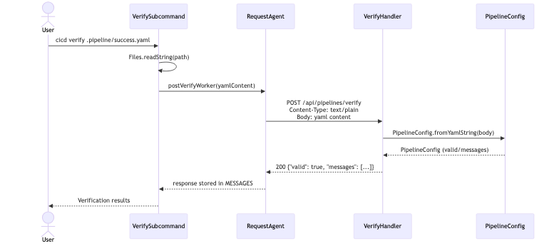
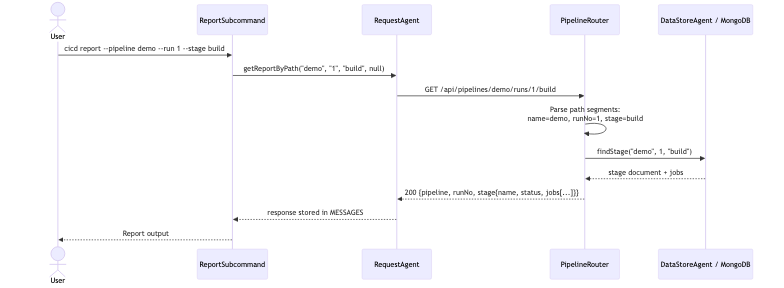
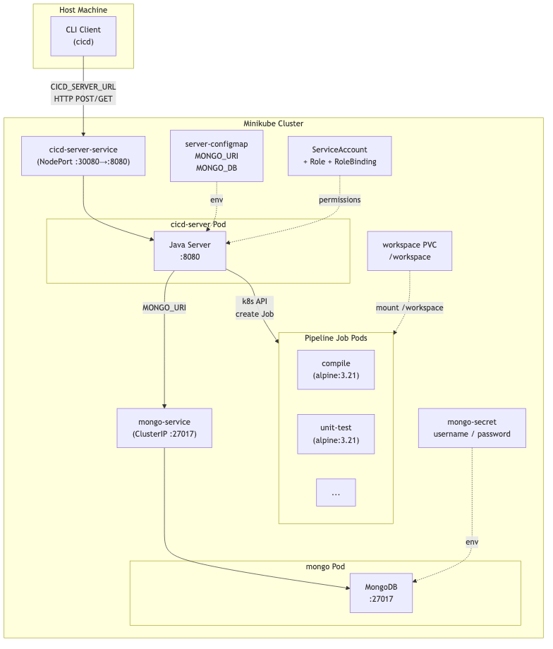

# Week 8 Design Update

This document describes the architectural changes made in Week 8. For the original design, see [initial-design.md](./initial-design.md).

---

## Change 1: RESTful API Migration (PR #103)

### Before (Week 1–7)

All four endpoints used `GET` with file paths as query parameters:

```
GET /api/pipelines/verify?file=/absolute/path/to/pipeline.yaml
GET /api/pipelines/dryrun?file=/absolute/path/to/pipeline.yaml
GET /api/pipelines/run?file=/absolute/path/to/pipeline.yaml&repo=/path&branch=main&commit=latest
GET /api/pipelines/report?pipeline=name&run=1&stage=test&job=compile
```

**Problem:** The client sends a local file path to the server. This breaks when client and server run on different machines (e.g., in Kubernetes), because the server cannot access the client's filesystem.

### After (Week 8)

**verify, dryrun, run** — Changed to `POST` with YAML content in the request body:

```
POST /api/pipelines/verify                                  Body: <yaml content>
POST /api/pipelines/dryrun                                  Body: <yaml content>
POST /api/pipelines/run?branch=...&commit=...[&repo=...]    Body: <yaml content>
```

The client reads the pipeline file locally and sends its content over HTTP. The server parses the YAML string directly via `PipelineConfig.fromYamlString()`. In k8s mode, `repo` is optional — the server uses PVC workspace instead of a local repo directory.

**report** — Changed to path-based routing with a new `PipelineRouter` handler:

```
GET /api/pipelines/{name}/runs
GET /api/pipelines/{name}/runs/{runNo}
GET /api/pipelines/{name}/runs/{runNo}/{stage}
GET /api/pipelines/{name}/runs/{runNo}/{stage}/{job}
```

### Migration strategy: Strangler Fig

All old GET endpoints remain functional. New POST/path-based endpoints are added alongside them.

### Updated sequence diagram (verify endpoint)



### Updated sequence diagram (report endpoint)



---

## Change 2: Kubernetes Deployment Architecture (PR #104, #108)

### Deployment topology



### Dockerfile

Multi-stage build:
1. **Build stage** (`eclipse-temurin:21-jdk`): copies source, runs `./gradlew :server:jar`
2. **Runtime stage** (`eclipse-temurin:21-jre`): copies only the fat jar, exposes port 8080

### Kubernetes resources

| Resource | File | Purpose |
|----------|------|---------|
| Secret | `mongo-secret.yaml` | MongoDB root username/password (base64) |
| Deployment + Service | `mongo-deployment.yaml` | MongoDB pod + ClusterIP service on :27017 |
| ConfigMap | `server-configmap.yaml` | `MONGO_URI` and `MONGO_DB` for the server |
| Deployment + Service | `server-deployment.yaml` | Server pod + NodePort service (30080→8080) |
| ServiceAccount + Role + RoleBinding | `rbac.yaml` | Grants server permission to create k8s Jobs, Pods, and PVCs |

### Pipeline job execution (dual mode)

The server auto-detects its environment:
- **Local mode**: uses `DockerJobExecutor` — creates Docker containers via Docker daemon
- **k8s mode**: uses `KubernetesJobExecutor` — creates native k8s Jobs with PVC workspace sharing

Detection: checks if `/var/run/secrets/kubernetes.io/serviceaccount/token` exists (only present inside k8s Pods).

Workspace sharing: a PersistentVolumeClaim (PVC) is created per pipeline run. All job Pods mount the same PVC at `/workspace`, allowing jobs to share files (e.g., `compile` writes `build/app.sh`, `unit-test` reads it). PVC is deleted after the pipeline run finishes.

### Helm chart (`helm/cicd-chart/`)

All k8s manifests are templatized with `{{ .Release.Name }}` prefixes and configurable via `values.yaml`:

| Parameter | Default | Description |
|-----------|---------|-------------|
| `mongo.image` | `mongo:7` | MongoDB image |
| `mongo.rootUsername` | `admin` | MongoDB root user |
| `mongo.rootPassword` | `password` | MongoDB root password |
| `server.image` | `cicd-server:latest` | Server image |
| `server.imagePullPolicy` | `Never` | Use local Minikube image |
| `server.replicas` | `1` | Server replica count |
| `server.service.nodePort` | `30080` | External port |
| `server.mongo.db` | `cicd` | Database name |

### CLI environment variable

`RequestAgent.java` reads `CICD_SERVER_URL` environment variable (defaults to `http://localhost:8080`), allowing the CLI to connect to the server running in Kubernetes.
